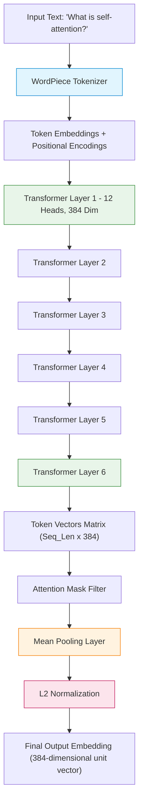
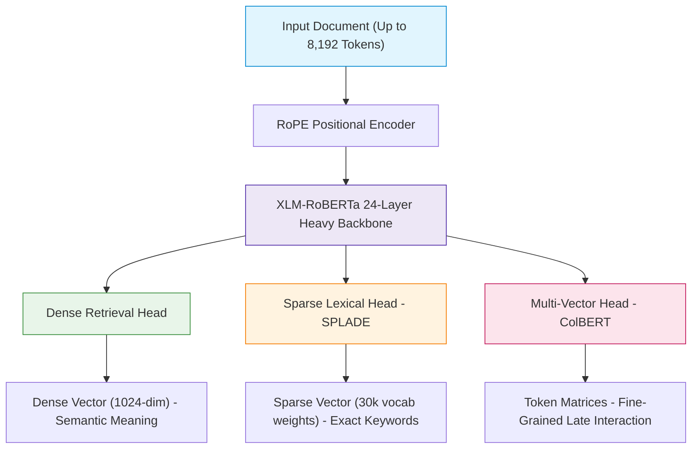

# Deep Dive: Embedding Model Architectures

> **Document Purpose:** Detailed architectural breakdown comparing our lightweight baseline (`all-MiniLM-L6-v2`) against the state-of-the-art (SOTA) embedding models in the market today (e.g., **BAAI BGE-M3**, **Voyage AI**, **Cohere embed-v3**, and **OpenAI text-embedding-3-large**).

---

## 🧭 Executive Summary

| Aspect | `all-MiniLM-L6-v2` (Our Baseline) | SOTA Open-Weights King: `BAAI BGE-M3` | SOTA Commercial Leader: `Voyage-3` / `Cohere-v3` |
| :--- | :--- | :--- | :--- |
| **Primary Role** | Ultra-lightweight, ultra-fast CPU baseline | Multi-modal, Multi-lingual, Multi-functionality dense+sparse | Enterprise high-accuracy semantic search |
| **Model Size** | **~80 MB** (22.7 Million parameters) | **~2.2 GB** (560 Million parameters) | Cloud API (Proprietary weights) |
| **Vector Dim** | **384** | **1024** (Supports Matryoshka shrinking) | **1024 / 1536** |
| **Context Window** | 256 tokens (~180 words) | **8,192 tokens** (~6,000 words) | **8,192 to 16,000 tokens** |
| **Retrieval Mode** | Pure Dense Vector | **Hybrid Trinity:** Dense + Lexical Sparse + ColBERT Multi-vector | Dense + Compression + Task-specific routing |

---

## 🔬 Model 1: `all-MiniLM-L6-v2` Architecture in Depth

`all-MiniLM-L6-v2` is one of the most famous and widely deployed embedding models in history. It was trained by the Sentence-Transformers team (Nils Reimers et al.) using Microsoft's **MiniLM** distillation technique.

### 1. Architectural Specifications:
- **Base Architecture:** 6-layer Transformer Encoder (half the depth of standard BERT-base).
- **Hidden Dimension ($d_{\text{model}}$):** 384 (standard BERT is 768).
- **Attention Heads:** 12 heads ($d_{\text{head}} = 384 / 12 = 32$).
- **Feed-Forward Dimension ($d_{\text{ff}}$):** 1536.
- **Parameters:** ~22.7 Million.

### 2. How it was Made: Self-Attention Knowledge Distillation
Instead of training a small model from scratch on raw text, Microsoft used a technique called **MiniLM Distillation**:
1. A massive "Teacher" model (like a 24-layer RoBERTa-Large or BERT-Large) was trained first.
2. The small 6-layer "Student" was trained to mimic the **Self-Attention Value-Relation Matrices** of the Teacher:
   $$\mathcal{L}_{\text{distill}} = D_{KL}\left(\text{Teacher Attention Distributions} \parallel \text{Student Attention Distributions}\right)$$
3. This allowed the 6-layer student to retain **over 99% of the teacher's comprehension** while being 5x faster and 80% smaller!

### 3. Step-by-Step Forward Pass:
1. **Tokenization:** Converts input string into WordPiece sub-word IDs (e.g. `["what", "is", "self", "-", "attention", "?"]`).
2. **Embedding Addition:** $\text{Input} = \text{WordEmbedding} + \text{PositionEmbedding} + \text{TokenTypeEmbedding}$.
3. **6 Transformer Blocks:** Through multi-head self-attention and feed-forward networks with GELU activations and LayerNorm.
4. **Mean Pooling:** 
   The output of Layer 6 is a tensor of shape `(Batch_Size, Sequence_Length, 384)`.
   We must collapse `Sequence_Length` into a single 384-dim vector. 
   MiniLM averages all valid token vectors across the sequence length (ignoring pad tokens via the attention mask):
   $$\vec{v}_{\text{passage}} = \frac{\sum_{i=1}^{L} m_i \cdot \vec{h}_i}{\sum_{i=1}^{L} m_i}$$
5. **L2 Normalization:** $\vec{u} = \frac{\vec{v}}{\|\vec{v}\|_2}$. This maps every embedding onto a unit sphere where Dot Product = Cosine Similarity.

---

## 👑 Model 2: The Modern SOTA — `BAAI BGE-M3` & Frontier Models

Today, the top-ranked open-weights embedding model is **BGE-M3** (by the Beijing Academy of Artificial Intelligence), while **Voyage-3** (by Voyage AI, founded by Stanford's Percy Liang) and **Cohere Embed-v3** lead the enterprise API space.

### What makes modern SOTA models so much more powerful?

### 1. The "M3" Trinity: Dense + Sparse + Multi-Vector in One Model
Traditional RAG requires two separate systems: BM25 (keyword search) + Sentence Transformers (semantic search).
**BGE-M3 produces all three retrieval representations simultaneously in a single forward pass:**

1. **Dense Retrieval:** Standard 1024-dimensional vector capturing abstract, high-level intent.
2. **Sparse Lexical Retrieval (Learned BM25):** 
   The model outputs importance weights for all 30,000+ words in its vocabulary. 
   If a text mentions `"COVID-19"` or `"iPhone 16 Pro Max"`, the sparse head assigns a huge score to those exact keywords, giving you the precision of BM25 without a separate engine!
3. **Multi-Vector ColBERT Late-Interaction:**
   Instead of compressing an 8,000-word document into one vector, it outputs an embedding for *every single token*. 
   During search, it computes the **MaxSim** (maximum similarity) between every query token and document token.

### 2. Matryoshka Representation Learning (MRL)
Named after Russian nesting dolls, modern models (like OpenAI `text-embedding-3` and BGE-M3) are trained with **Matryoshka Loss**:
- The most critical semantic information is forced into the **first 64, 128, 256, or 512 dimensions**.
- If your database storage is tight, you can simply **slice the first 256 numbers** of the 1024-dim vector!
- You save 75% memory/RAM with less than **1% drop in retrieval accuracy**.

### 3. Rotary Position Embeddings (RoPE) & 8,192 Context Window
- MiniLM uses absolute position embeddings, capped hard at 256 tokens.
- Modern models use **Rotary Position Embeddings (RoPE)**. 
- Instead of adding position numbers, RoPE rotates the Query and Key vectors in complex space. This allows embedding entire multi-page reports (up to 8,192 tokens) without losing structural context.

---

## 📊 Comprehensive Architectural Comparison

| Architectural Feature | `all-MiniLM-L6-v2` | `BAAI BGE-M3` (Open SOTA) | `Voyage-3` (API SOTA) | `OpenAI text-embedding-3-large` |
| :--- | :--- | :--- | :--- | :--- |
| **Base Backbone** | Distilled MiniLM | Distilled XLM-RoBERTa | Proprietary Transformer | Proprietary Transformer |
| **Parameters** | 22.7 Million | 560 Million | ~1+ Billion (est.) | Unknown |
| **Layer Depth** | 6 Layers | 24 Layers | 24+ Layers | Unknown |
| **Vector Dimension** | **384** | **1024** | **1024** | **3072** (Shrinkable to 256/1024) |
| **Max Tokens** | 256 (~180 words) | 8,192 (~6,000 words) | 16,000 (~12,000 words) | 8,192 (~6,000 words) |
| **Positional Encoding**| Learned Absolute | RoPE (Rotary) | RoPE + FlashAttention-2 | RoPE |
| **Multi-Lingual** | English only | 100+ Languages | English + Code-optimized | Multi-Lingual |
| **Sparse Weights** | ❌ No | ✅ Yes (Native SPLADE) | ❌ No | ❌ No |
| **Multi-Vector ColBERT**| ❌ No | ✅ Yes (Native MaxSim) | ❌ No | ❌ No |
| **Matryoshka Slicing** | ❌ No (Fixed 384) | ✅ Yes | ✅ Yes | ✅ Yes |

---

## 🎤 Interview Questions & Architectural Takeaways

### Q1: What is the difference between Single-Vector Bi-Encoder (MiniLM) and Multi-Vector Late-Interaction (ColBERT / BGE-M3)?
**Simple Answer:**
- **Bi-Encoder (MiniLM):** Compresses the entire sentence into **one single vector**. Fast to compare with dot products, but can lose subtle word-to-word details in long paragraphs.
- **Late-Interaction (ColBERT):** Keeps a vector for **every word**. To score relevance, it finds the closest matching document word for every query word and sums their scores ($\text{MaxSim}$). It is much more accurate for detailed reasoning, but takes more storage.

### Q2: How does Matryoshka Representation Learning (MRL) work?
**Simple Answer:**
- Normally, all dimensions of an embedding vector share information equally.
- In Matryoshka training, the loss function explicitly rewards the model if the first $d$ dimensions (e.g., first 128, 256, 512 numbers) can solve the retrieval task on their own.
- This allows developers to truncate vectors to smaller sizes to save RAM and index storage in FAISS without re-training.

### Q3: Why is `all-MiniLM-L6-v2` still the preferred choice for this student lab project?
**Simple Answer:**
- **Efficiency:** Loads in under 1 second, weighs only 80MB, and requires zero GPU or API keys.
- **Experimental Integrity:** In Stage 3, we build our custom PyTorch Attention Encoder. Comparing a custom lightweight attention model against a lightweight MiniLM provides a fair, realistic, and scientifically sound benchmark!
