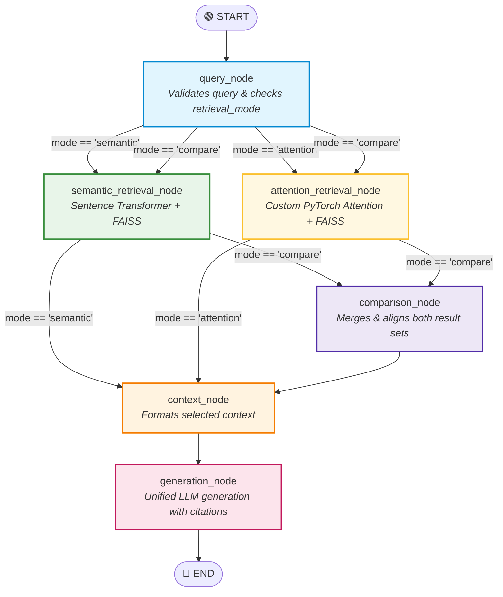

# Stage 2 Notes: LangGraph Skeleton & Baseline Semantic Retrieval

## 🌟 The Big Picture: Our Final Pipeline Architecture (Stage 6 Graph)

Before building individual files, here is the complete end-state graph we are building toward.
By designing our nodes and state cleanly in Stage 2, this same graph will seamlessly support **single-mode retrieval** as well as **parallel side-by-side comparison**:



> **In Stage 2**, we build the foundational linear spine:
> `START` $\to$ `query_node` $\to$ `semantic_retrieval_node` $\to$ `context_node` $\to$ `generation_node` $\to$ `END`.

---

## 📌 Sub-Stage 2.1: State Design (`graph/state.py`)

### 1. What is LangGraph State (`RAGState`)?
Think of **State** like a clipboard that gets passed along an assembly line:
1. Person 1 (`query_node`): Writes down the user's question on the clipboard.
2. Person 2 (`semantic_retrieval_node`): Searches FAISS and attaches the top matching paragraphs to the clipboard.
3. Person 3 (`context_node`): Formats those paragraphs neatly into context text.
4. Person 4 (`generation_node`): Reads the question and paragraphs from the clipboard and writes the final answer.

In [`graph/state.py`](file:///d:/Projects/RAG/Attention_RAG/graph/state.py), this clipboard is defined as:
```python
class RAGState(TypedDict):
    query: str                   # The user's question
    retrieval_mode: str          # "semantic", "attention", or "compare"
    semantic_results: list       # Chunks found by Sentence Transformer
    attention_results: list      # Chunks found by custom Attention model
    selected_context: list       # Final chunks formatted for the LLM
    answer: str                  # The final generated answer
```

### 2. Why use `TypedDict` instead of `Pydantic` or raw `dict`?
- **Plain `dict`:** No auto-complete; typos like `state["sematic"]` fail silently or crash later.
- **`Pydantic`:** Validates data on every single step, adding unnecessary speed overhead inside graph cycles.
- **`TypedDict`:** Gives auto-complete & type checking in your editor with **zero speed penalty** at runtime.

### 🎤 Sub-Stage 2.1 Interview Questions:
- **Q: How does state flow between nodes in LangGraph?**
  - *Answer:* When a node runs, LangGraph passes `state` as an argument. The node does its work and returns only the keys it wants to update (e.g. `{"semantic_results": [...]}`). LangGraph merges those updates into the state clipboard before invoking the next node.
- **Cross-Q: Why is passing a shared state better than normal function arguments `func(a, b, c)`?**
  - *Answer:* With normal arguments, every intermediate function must accept and pass through variables it doesn't care about. With a shared State, every node has access to the full context clipboard and only reads or modifies what it needs.

---

## 📌 Sub-Stage 2.2: Semantic Retriever & FAISS Deep Dive (`embeddings/semantic_retriever.py`)

### 1. Embedding Model Options & Trade-offs
| Model Option | Vector Size (Dim) | Model Weight Size | Run Location | Pros | Cons |
| :--- | :---: | :---: | :---: | :--- | :--- |
| **`all-MiniLM-L6-v2`** *(Chosen)* | **384** | **~80 MB** | 💻 100% Local (CPU/GPU) | • Ultra-fast (~5ms on CPU)<br>• Zero API cost or keys<br>• Gold standard for student & prototyping RAG | • Max 256 tokens context<br>• Lower accuracy on deep legal/medical jargon |
| **`BAAI/bge-small-en-v1.5`** | **384** | **~130 MB** | 💻 100% Local (CPU/GPU) | • Slightly higher score on MTEB retrieval benchmark<br>• Great general retrieval | • Slightly slower than MiniLM<br>• Needs query instruction prefix |
| **OpenAI `text-embedding-3-small`** | **1536** | Cloud API | ☁️ OpenAI Cloud | • Huge 8,192 token limit<br>• High semantic accuracy<br>• Supports dimension reduction | • Requires paid API key<br>• Network latency (100-300ms)<br>• Cannot run offline |
| **Google `text-embedding-004` (Gemini)** | **768** | Cloud API | ☁️ Google Cloud | • Strong multimodal alignment<br>• Tight Google Cloud integration | • Requires Google API key & network calls |
| **Specialized Models (`BioBERT`, `SciBERT`)** | **768** | **~440 MB** | 💻 Local | • Trained specifically for scientific/biomedical texts | • Poor on general out-of-domain queries |

---

### 2. FAISS (Facebook AI Similarity Search) In-Depth

#### What is FAISS?
**FAISS** is an open-source C++ library created by **Meta AI** designed specifically for searching through billions of dense vectors in sub-millisecond speeds.

```mermaid
graph TD
    Query["User Query: 'What is attention?'"] --> Encode["Encoder Model"]
    Encode --> QVec["Query Vector: [0.12, -0.45, ... 0.88] (384-dim)"]
    QVec --> Norm["L2 Normalize: ||v|| = 1.0"]
    Norm --> FAISS["FAISS IndexFlatIP (Matrix Multiplication)"]
    
    subgraph FAISS Vector Matrix
        D1["Doc 1 Vector"]
        D2["Doc 2 Vector"]
        D3["Doc 3 Vector"]
        DN["Doc N Vector"]
    end
    
    FAISS --> FAISS Vector Matrix
    FAISS Vector Matrix --> Scores["Compute Dot Products [0.89, 0.42, 0.94, ...]"]
    Scores --> TopK["Top-K Selection: [Doc 3 (0.94), Doc 1 (0.89)]"]

    style Query fill:#e1f5fe,stroke:#0288d1
    style Encode fill:#e8f5e9,stroke:#388e3c
    style Norm fill:#fff3e0,stroke:#f57c00
    style FAISS fill:#ede7f6,stroke:#512da8
    style TopK fill:#fce4ec,stroke:#c2185b
```

#### Why not just use a Python `for` loop or NumPy?
If you have 10,000 document chunks and a user asks a question:
- A pure Python loop calculating cosine similarity for each vector is **extremely slow** (takes 50–200ms).
- **FAISS is written in highly optimized C++** with CPU SIMD hardware instructions (AVX-512, SSE) and multi-threading via OpenMP. It executes the search over 10,000 vectors in **under 0.2 milliseconds**.

#### The Core Types of FAISS Indexes (From Exact to Large-Scale Approximate):

| Index Type | Full Name | How It Works | Search Speed | Accuracy (Recall) | Best Use Case |
| :--- | :--- | :--- | :--- | :--- | :--- |
| **`IndexFlatIP`** *(What we use)* | **Flat Inner Product** | Compares query vector against **every single document vector** (Brute-force dot product). | ⚡ Fast for < 100,000 vectors (~0.5ms) | 🎯 **100% Exact** (Zero error) | Small/Medium datasets, academic benchmarks, student labs. |
| **`IndexFlatL2`** | **Flat Euclidean** | Brute-force Euclidean straight-line distance ($L_2$). | ⚡ Fast for < 100,000 vectors | 🎯 **100% Exact** | Non-normalized spatial data. |
| **`IndexIVFFlat`** | **Inverted File Flat** | Clusters vectors into $N$ Voronoi cells using K-Means. At search time, it only checks vectors in the closest 2–3 cells instead of the whole dataset. | ⚡⚡ Very Fast for 100k to 10M vectors | 📉 ~95% (Approximate Nearest Neighbors / ANN) | Large production datasets where 100% exactness can be traded for speed. |
| **`IndexHNSW`** | **Hierarchical Navigable Small World** | Builds a multi-layer graph of vectors. The search "hops" across graph nodes to zoom in on neighbors. | ⚡⚡⚡ Ultra Fast | 🎯 ~98–99% ANN | High-throughput enterprise RAG (e.g. Pinecone/Weaviate style). |
| **`IndexPQ`** | **Product Quantization** | Compresses 384 numbers into a short byte string (lossy compression). | ⚡⚡⚡ Super Fast + Saves 90% RAM | 📉 ~80–90% ANN | Storing billions of vectors on a single machine with low RAM. |

#### Why did we choose `IndexFlatIP`?
1. **100% Scientific Precision:** It has zero approximation error. Every result returned is the mathematically true closest match.
2. **Dot Product = Cosine Similarity:** Because we L2-normalize all vectors ($\|v\|_2 = 1.0$), the inner product $\vec{q} \cdot \vec{d}$ is mathematically identical to cosine similarity $\cos(\theta)$.

---

### 🎤 Sub-Stage 2.2 Interview Questions:

- **Q: MiniLM is already a Transformer containing self-attention. Why build a custom Attention encoder, and what does this experiment actually test?**
  - *Answer:*
    1. **Architecture Difference:** MiniLM is a deep 6-layer Transformer with heavy feed-forward blocks, pre-trained on over 1 Billion general sentences. Our custom model isolates a single, lightweight Multi-Head Attention layer trained from scratch on domain triplets.
    2. **The Analogy:** MiniLM is the *Encyclopedic Scholar* (knows all of Wikipedia). Our custom encoder is the *Dedicated Specialist* (starts with zero knowledge, learns only our specific document domain using attention).
    3. **The Core Question Tested:** We are testing whether a lightweight, self-trained attention layer can capture domain-specific semantic relationships for retrieval with lower latency and memory, or if massive pre-training is indispensable.

- **Q: Why use Cosine Similarity instead of Euclidean Distance ($L_2$) for text retrieval?**
  - *Answer:* Euclidean distance measures the straight-line distance between two points, which is sensitive to text length. Cosine similarity measures the **angle (direction)** between two vectors, capturing the conceptual meaning regardless of text length differences.

- **Cross-Q: Why L2-normalize embeddings before indexing into FAISS `IndexFlatIP`?**
  - *Answer:* The cosine similarity formula is $\cos(\theta) = \frac{A \cdot B}{\|A\| \|B\|}$. By pre-normalizing vectors ($\|A\|=1, \|B\|=1$), the formula becomes just $A \cdot B$ (a simple dot product). This removes square roots and division from search time, allowing FAISS to search thousands of documents in microseconds.

- **Cross-Q: What is the difference between Flat indexes (`IndexFlatIP`) and Approximate indexes (`IndexIVFFlat` / `HNSW`) in FAISS?**
  - *Answer:* Flat indexes are brute-force (comparing against 100% of vectors) and guarantee 100% exact accuracy. Approximate indexes (ANN) cluster vectors or build graphs to search only a small fraction of the dataset, achieving 10x–50x higher speed on millions of vectors at the cost of a small ~1–5% drop in retrieval accuracy.

---

## 📌 Sub-Stage 2.3: LangGraph Node Functions (`graph/nodes.py`)

### 1. The 4 Core Nodes & Their Responsibilities:
| Node Name | Real-World Role | What It Does | Keys It Updates |
| :--- | :--- | :--- | :--- |
| **`query_node`** | The Receptionist | Cleans up the user's question and sets the default mode (`"semantic"`). | `{"query": ..., "retrieval_mode": ...}` |
| **`semantic_retrieval_node`** | The Librarian | Calls our `SemanticRetriever` to search FAISS and finds the top 3 closest chunks. | `{"semantic_results": [...]}` |
| **`context_node`** | The Editor | Formats the retrieved chunks into clean text blocks with page citations. | `{"selected_context": [...]}` |
| **`generation_node`** | The Writer | Uses the selected context to write the final response. *(Stub in Stage 2, real LLM in Stage 7)*. | `{"answer": ...}` |

### 🎤 Sub-Stage 2.3 Interview Questions:
- **Q: Why do LangGraph node functions return a dictionary instead of modifying `state` in-place?**
  - *Answer:* LangGraph uses **immutable state updates**. Returning a new dictionary prevents side-effects, makes debugging easy, and allows nodes to run concurrently without memory race conditions.
- **Cross-Q: Why split `state.py`, `nodes.py`, `edges.py`, and `build_graph.py` into separate files?**
  - *Answer:* Separation of concerns. `state.py` defines schemas, `nodes.py` contains business logic, `edges.py` handles routing conditions, and `build_graph.py` compiles the workflow. This makes the project extensible without having one giant messy file.

---

## 📌 Sub-Stage 2.4: Graph Construction & Execution (`graph/build_graph.py`)

### 1. Compiling the Graph:
In [`graph/build_graph.py`](file:///d:/Projects/RAG/Attention_RAG/graph/build_graph.py), we use LangGraph's `StateGraph`:
1. Register the state schema: `workflow = StateGraph(RAGState)`.
2. Add our 4 nodes: `workflow.add_node("query_node", ...)`, etc.
3. Wire the straight-line edges: `START` $\to$ `query_node` $\to$ `semantic_retrieval_node` $\to$ `context_node` $\to$ `generation_node` $\to$ `END`.
4. Compile: `app = workflow.compile()`.

### 🎤 Sub-Stage 2.4 Interview Questions:
- **Q: Why model this as a LangGraph state graph instead of a simple linear Python function?**
  - *Answer:* A simple function pipeline breaks down when you introduce conditional routing (e.g. routing between attention vs semantic retriever) and parallel fan-out / fan-in execution (running both retrievers at once and merging results). LangGraph provides first-class state checkpointing, branching, and parallelism out of the box.
