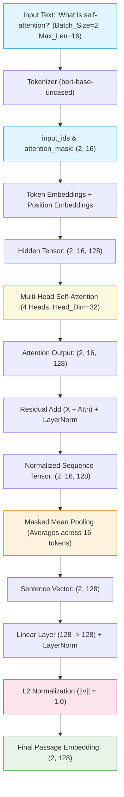

# Stage 3 Notes: Custom PyTorch Multi-Head Attention Encoder (Untrained)

## 🌟 What did we build in Stage 3?
In this stage, we built our own **custom PyTorch neural network from scratch** in [`embeddings/attention_encoder.py`](file:///d:/Projects/RAG/Attention_RAG/embeddings/attention_encoder.py).
Instead of calling a black-box pre-trained library, we assembled the exact deep learning layers that power modern transformer attention.

---

## 🧱 Architecture Flow & Tensor Shape Breakdown

Here is the exact step-by-step journey of a sentence through our custom model, tracking tensor shapes at every single layer:

### 📊 Layer-by-Layer Tensor Shapes:

| Step | Layer / Operation | Input Shape | Output Shape | What happens? |
| :--- | :--- | :--- | :--- | :--- |
| **1** | **Tokenization** | Raw text string | `(Batch_Size, Seq_Len)` | Words converted to vocabulary integer IDs. |
| **2** | **Embedding Layer** | `(Batch_Size, Seq_Len)` | `(Batch_Size, Seq_Len, 128)` | Each token ID is mapped to a 128-dimensional dense vector + Position encoding is added. |
| **3** | **Multi-Head Attention** | `(Batch_Size, Seq_Len, 128)` | `(Batch_Size, Seq_Len, 128)` | 4 attention heads compute token-to-token similarity weights in parallel. |
| **4** | **Residual + LayerNorm** | `(Batch_Size, Seq_Len, 128)` | `(Batch_Size, Seq_Len, 128)` | Prevents vanishing gradients and stabilizes activations: $\text{LayerNorm}(x + \text{Attn}(x))$. |
| **5** | **Masked Mean Pooling** | `(Batch_Size, Seq_Len, 128)` | `(Batch_Size, 128)` | Collapses the sequence length into **one single 128-number vector** representing the entire sentence (ignoring padding). |
| **6** | **Linear Projection** | `(Batch_Size, 128)` | `(Batch_Size, 128)` | Learnable feed-forward layer allowing the model to adapt representations during training. |
| **7** | **L2 Normalization** | `(Batch_Size, 128)` | `(Batch_Size, 128)` | Scales the vector to length 1.0 ($\|v\|_2 = 1.0$) so Dot Product equals Cosine Similarity. |

---

## 🧮 Self-Attention Math Explained in Plain English

### 1. What are $Q$, $K$, and $V$? (The Filing Cabinet Analogy)
- **Query ($Q$):** What you are looking for (*"Show me information about attention weights"*).
- **Key ($K$):** The label/tag on each folder in the filing cabinet (*"This folder is about attention math"*).
- **Value ($V$):** The actual content inside the folder.

### 2. The Famous Formula:
$$\text{Attention}(Q, K, V) = \text{softmax}\left(\frac{Q K^T}{\sqrt{d_k}}\right) V$$

1. **$Q K^T$ (Dot Product):** Multiplies every word's Query by every word's Key. If two words are strongly related, their dot product is a large positive number.
2. **Dividing by $\sqrt{d_k}$ (Scaling Factor):** 
   - When vector dimensions $d_k$ get large, dot products become huge numbers.
   - Huge numbers push the `softmax` function into regions with near-zero gradients (the model stops learning).
   - Dividing by $\sqrt{d_k}$ (e.g. $\sqrt{32} \approx 5.65$) keeps numbers in a healthy range.
3. **`softmax`:** Converts similarity scores into percentages/probabilities that add up to 1.0 (100% attention budget per token).
4. **Multiplying by $V$:** Produces a weighted blend of the actual word values.

### 3. Why Multi-Head Attention (4 heads) instead of 1 big head?
- One single attention head can only focus on **one type of relationship at a time** (e.g. connecting verbs to nouns).
- With **4 heads**, each head operates in its own 32-dimensional subspace:
  - *Head 1* can focus on syntactic grammar (*"who did what"*).
  - *Head 2* can focus on semantic synonyms (*"RAG"* $\leftrightarrow$ *"Retrieval"*).
  - *Head 3* can focus on positional neighbors (*words right next to each other*).
  - *Head 4* can focus on long-range document context.

---

## ❓ Why Masked Mean Pooling over `[CLS]` Token?

- In BERT, the first token is `[CLS]`. BERT was pre-trained for thousands of GPU hours with a classification head attached to `[CLS]`.
- In our **custom model built from scratch**, `[CLS]` has no special meaning—it is just another random token.
- **Masked Mean Pooling** calculates the true average of all contextualized word vectors in the sentence (while strictly ignoring zero-padded tokens). This provides a far richer and more stable summary of the entire sentence than an untrained single token!

---

## 🎤 Interview Questions & Realistic Cross-Questions

### Q1: Walk me through what happens inside a single Multi-Head Attention layer.
**Simple Answer:**
- Input tensor $X$ is multiplied by three weight matrices ($W_q, W_k, W_v$) to produce Queries ($Q$), Keys ($K$), and Values ($V$).
- The vectors are split across $H$ heads ($d_{\text{head}} = d_{\text{model}} / H$).
- For each head, we compute attention weights $\text{softmax}(QK^T / \sqrt{d_k})$ and multiply by $V$.
- The outputs from all heads are concatenated back together and passed through a final linear projection.

### Cross-Q: Why is self-attention $O(N^2)$ in time and memory complexity?
**Simple Answer:**
- Because every token in a sequence of length $N$ must compute an attention score with every other token in the sequence.
- Calculating $Q K^T$ generates an $N \times N$ attention matrix. 
- If you double the sequence length ($N \to 2N$), the computation and memory quadruples ($4\times$).

### Cross-Q: Why is an untrained attention layer useless for retrieval before Stage 4?
**Simple Answer:**
- With randomly initialized weights, $W_q, W_k, W_v$ produce arbitrary, random attention distributions.
- Cosine similarity between two random vectors will be noisy and meaningless.
- In **Stage 4**, we will use **Contrastive Triplet Loss** to pull true question-answer pairs close together and push irrelevant negative chunks far apart, training the attention weights to learn genuine semantic connections.
